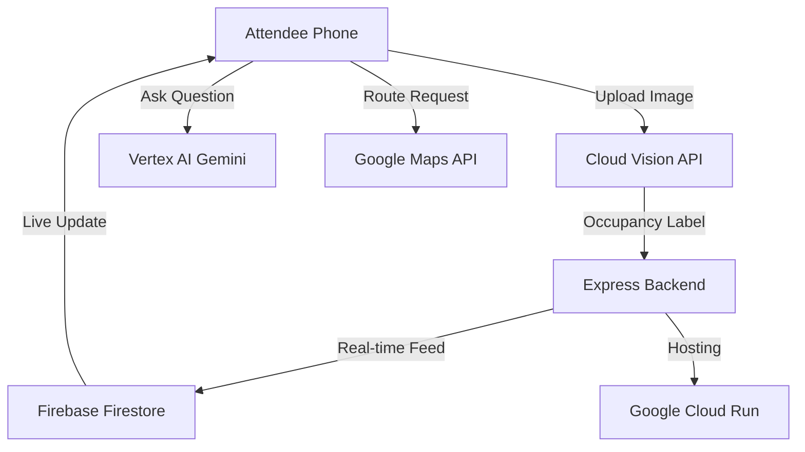

# 🏟️ CrowdFlow AI: Smart Stadium Experience Platform

**CrowdFlow AI** is a cutting-edge, cloud-native platform designed to revolutionize the fan experience at large-scale venues. By combining Real-Time Computer Vision, Generative AI, and Geo-Spatial Rerouting, we mitigate congestion and optimize crowd movement in real-time.

---

## 🏗️ System Architecture



---

## ✨ Full Feature Overview

### 1. 👁️ Cloud Vision Analytics
- **Local Compression**: Images are compressed via HTML5 Canvas (12MB -> 150KB) to ensure high-speed uploads in crowded stadium environments with low bandwidth.
- **Auto-Labeling**: Integrates with **Google Cloud Vision API** to detect "Person" objects.
- **Risk Profiles**: Automatically identifies `🔴 OVERCROWDED`, `🟡 MODERATE`, or `🟢 LOW` states based on headcounts.

### 2. 🤖 Gemini AI Smart Assistant
- **Vertex AI Core**: Uses `gemini-1.5-pro` to answer attendee questions about parking, seating, and restroom queues.
- **Security**: Prompt engineering ensures the bot stays on task as a stadium assistant.
- **Resiliency**: Built-in fallback to local logic if the AI service encounters quota limits.

### 3. 🌐 Instant Localized Instructions
- **Translation API**: One-click switching between **Hindi, Bengali, Telugu, Marathi, Tamil, and Gujarati**.
- **Real-Time Feed**: All live incident alerts are dynamically translated to the user's preferred language.

### 4. 📍 Smart Rerouting (Maps)
- Integrated Google Maps with a focus on **Indoor Directionality**.
- Points of interest (Washrooms, Gates, VIP areas) are dynamically highlighted based on current congestion levels.

---

## 🛠️ Technical Stack

- **Frontend**: React 18, Vite, Tailwind CSS, Google Maps SDK, Firebase Web SDK.
- **Backend**: Node.js, Express, Google Cloud SDK (Vision, Translate, Vertex AI, Storage).
- **Hosting**: Google Cloud Run (Containerized).
- **Database**: Firebase Firestore (Real-time NoSQL).
- **Security**: Express Rate Limiter, Helmet.js, Origin Validation.

---

## 🚀 Detailed Setup Guide

### 1. Google Cloud Project Setup
1. Create a project at [GCP Console](https://console.cloud.google.com).
2. **Enable APIs**: 
   - [x] Cloud Run API
   - [x] Cloud Vision API
   - [x] Cloud Translation API
   - [x] Vertex AI API
   - [x] Maps JavaScript API & Places API
3. Create a **Firebase Project** and link it to your GCP project.

### 2. Local Environment Configuration
Create a `.env` in the **root** folder:
```env
VITE_MAPS_API_KEY=your_key_here
VITE_BACKEND_URL=http://localhost:8080
```

Create a `.env` in the **backend** folder:
```env
PORT=8080
GOOGLE_CLOUD_PROJECT=your_project_id
FRONTEND_ORIGIN=http://localhost:5173
```

### 3. Local Development
```bash
# Terminal 1: Backend
cd backend
npm install
gcloud auth application-default login # CRITICAL for local Cloud Vision/Vertex AI
npm start

# Terminal 2: Frontend
npm install
npm run dev
```

---

## ☁️ Deployment Playbook (Cloud Run)

The project includes a unified `deploy.sh` script for Google Cloud Shell.

### Steps to Deploy:
1. Open [Google Cloud Shell](https://shell.cloud.google.com/).
2. Clone/Pull your repo: `git pull origin main`.
3. Run: `bash deploy.sh`.

### 🔍 Troubleshooting Common Errors:
- **`Quota Exceeded`**: Change the `REGION` in `deploy.sh` to `us-central1`.
- **`Maps not loading`**: Ensure the API key restriction in GCP allows `http://localhost:*/*` and your Cloud Run domain.
- **`Backend Connection Error`**: Ensure `FRONTEND_ORIGIN` in the Backend environment matches your live site URL.

---

## 📂 Directory Structure

```text
├── backend/            # Express.js API
│   ├── src/
│   │   ├── services/   # GCP SDK Integrations (Vision, Vertex, etc.)
│   │   └── server.js   # Main API Entry
│   └── Dockerfile      # Backend Container Config
├── src/                # React Frontend
│   ├── components/     # UI Modules
│   ├── assets/         # Static Media
│   └── App.jsx         # Main Application Logic
├── Dockerfile          # Frontend Container Config
├── deploy.sh           # Unified GCP Deployment Script
└── README.md           # This Document
```

---

## 🤝 Connect with the Developer

[](https://whatsapp.com/channel/0029VbCB6SpLo4hdpzFoD73f)
[](https://t.me/drabhishekjourney)
[](https://t.me/+RujS6mqBFawzZDFl)
[](https://www.instagram.com/drabhishek)
[](https://linkedin.com/company/dr-abhishek)
[](https://www.youtube.com/@drabhishek.5460)

**Enjoy avoiding the crowds with CrowdFlow!**
